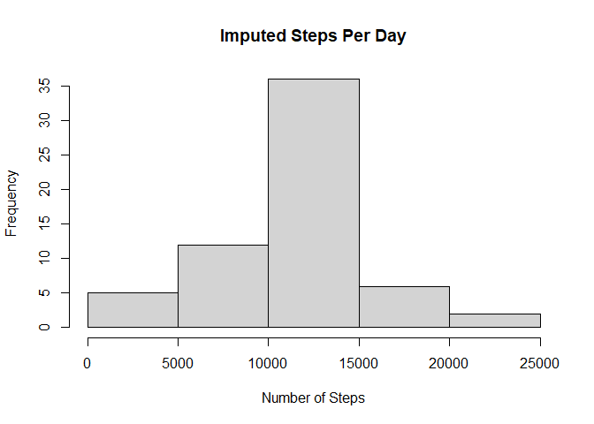

We first unzip the data is not already done and load the data using read.csv() function.  
if required further processing is to be done.  

## Loading and preprocessing the data

```r
if(!file.exists("activity.csv")){
  unzip(zipfile = "activity.zip")
}

activitydata <- read.csv("activity.csv")
```


Make an Histogram of the total number of steps taken per day and than calculate mean and median of the total number of steps taken.  

## What is mean total number of steps taken per day?

```r
totalsteps <- aggregate(steps ~ date, activitydata, FUN = sum, na.rm = TRUE)
total <- sum(totalsteps$steps)
```
The total number of steps taken per day are 570608.


```r
hist(totalsteps$steps, main = "Total Steps Per Day", xlab = "Number of Steps")
```

<!-- -->


```r
meansteps <- mean(totalsteps$steps, na.rm = TRUE)
mediansteps <- median(totalsteps$steps, na.rm = TRUE)
```
The mean of total steps taken per day is 1.0766189\times 10^{4} and median is 10765


Here we plot the average daily activity pattern for different intervals and than find the 5 minute interval that has maximum number of steps.  

## What is the average daily activity pattern?

```r
stepsbyint <- aggregate(steps ~ interval, activitydata, mean, na.rm = TRUE)
ggplot(data = stepsbyint, aes(x = interval, y = steps)) +
  geom_line() +
  ggtitle("Average Daily Activity Pattern") +
  xlab("5-minute interval") +
  ylab("Average number of Steps") + theme(plot.title = element_text(hjust = 0.5))
```

<!-- -->


```r
maxsteps <- stepsbyint[which.max(stepsbyint$steps),]
```
On average accross all days in dataset, the 5-minute interval containing maximum number of steps is 835, 206.1698113.


Here we impute the missing values with mean of the intervals.  

## Imputing missing values

```r
missingvals <- length(which(is.na(activitydata$steps)))
```
There are 2304 missing values in the dataset


```r
impute <- transform(activitydata,
                              steps = ifelse(is.na(activitydata$steps),
                                             stepsbyint$steps[match(activitydata$interval, 
                                                                        stepsbyint$interval)],
                                             activitydata$steps))
impstepsbyint <- aggregate(steps ~ date, impute, FUN = sum)
hist(impstepsbyint$steps, main = "Imputed Steps Per Day", xlab = "Number of Steps")
```

<!-- -->


```r
impmeansteps <- mean(impstepsbyint$steps, na.rm = TRUE)
impmediansteps <- median(impstepsbyint$steps, na.rm = TRUE)
diffmean <- impmeansteps - meansteps
diffmedian <- impmediansteps - mediansteps
difftotal <- sum(impstepsbyint$steps) - sum(totalsteps$steps)
```
After imputing the data the mean of total number of steps taken per day is 1.0766189\times 10^{4} and median is 1.0766189\times 10^{4}.  
The difference in mean from the original and imputed data is 0 and that of median is 1.1886792. Difference in total steps is 8.6129509\times 10^{4}.  


We plot the activity patterns for weekdays and weekends.  

## Are there differences in activity patterns between weekdays and weekends?

```r
DayType <- function(date) {
  day <- weekdays(date)
  if (day %in% c('Monday', 'Tuesday', 'Wednesday', 'Thursday', 'Friday'))
      return ("weekeday")
  else if (day %in% c('Saturday', 'Sunday'))
      return ("weekend")
  else
      stop ("Invalid Date Format.")
}
impute$date <- as.Date(impute$date)
impute$day <- sapply(impute$date, FUN = DayType)

meanStepsByDay <- aggregate(steps ~ interval + day, impute, mean)
ggplot(data = meanStepsByDay, aes(x = interval, y = steps)) + 
  geom_line() +
  facet_grid(day ~ .) +
  ggtitle("Average Daily Activity Pattern") +
  xlab("5-minute Interval") +
  ylab("Average Number of Steps") +
  theme(plot.title = element_text(hjust = 0.5))
```

<!-- -->
